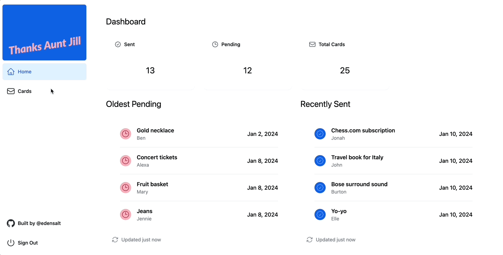
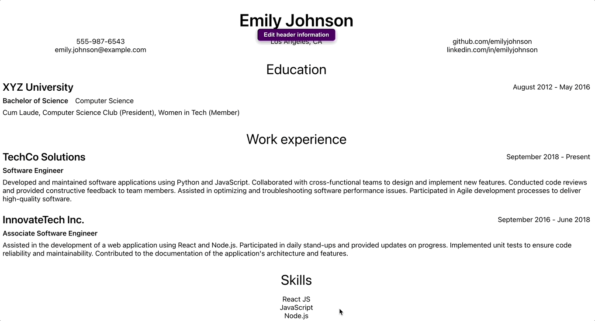

### Welcome! Thanks for stopping by 👋

👩‍💻 I'm Eden, software engineer and NYT crossword enthusiast. I am currently a consultant at Big Lift Software, building intuitive, beautiful products.

## About me

My focus is frontend development, though my work touches full-stack engineering. Check out my tech stack - maybe you got BINGO for your next project! And if not, I'm a very fast learner ⚡

## My stack

- Front end technologies: Javascript, Typescript, HTML, CSS
- Front end frameworks & libraries: React, Next.js, Tailwind, SASS
- Back end technologies: Javascript, Typescript, Terraform
- Back end frameworks: NestJS, Node.js, RESTful APIs
- Database: PostgreSQL, DynamoDB
- Version control: Git
- Build Tools: Vite, Webpack
- Development IDEs: Visual Studio Code
- Web services: AWS, Supabase, Vercel, OpenAI

## My favorite projects

You can check out all of my projects <a href="https://github.com/edensalt?tab=repositories">here</a>. Preview some of my favorites below!

### Thanks Aunt Jill
<a href="https://github.com/edensalt/thanks-aunt-jill">Repo</a> || <a href="https://www.thanksauntjill.com/">Live preview</a>

### CV generator
<a href="https://github.com/edensalt/cv-application">Repo</a> || <a href="https://edensalt.github.io/cv-application/">Live preview</a>

### Weather app
<a href="https://github.com/edensalt/weather-app">Repo</a> || <a href="https://edensalt.github.io/weather-app/">Live preview</a>

## My backstory

📈 Before my pivot into programming, I worked for early-stage health-tech start-ups, focusing on marketplace operations and account management. I'm naturally drawn to the energy of start-up environments and the mission of healthcare companies.

🌊 I am a graduate of Tulane University (roll wave!) My degree in public health drives my passion for helping patients in my work, and one of my core values is supporting others in achieving good health.

## Fun facts

📖 I am an avid reader and especially drawn to sci-fi.

🧗‍♀️ I'm a rock climber and enjoy spending my weekends out at the crag.

☕️ Like most programmers, I have a coffee addiction. My mornings always start with a pour-over.
