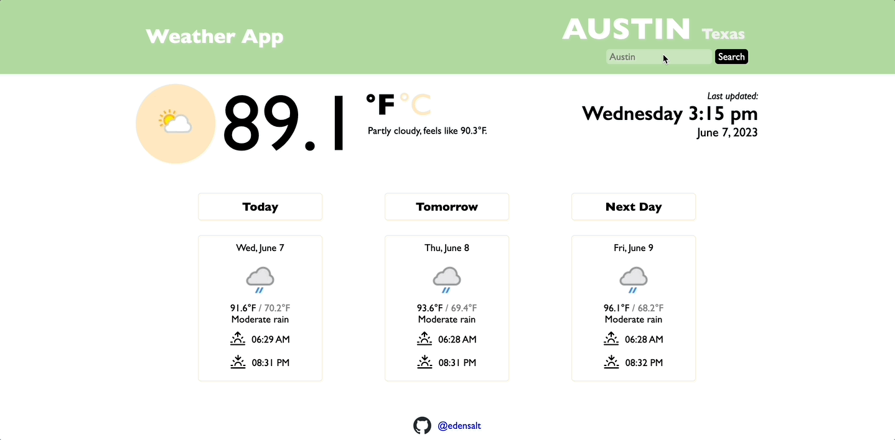
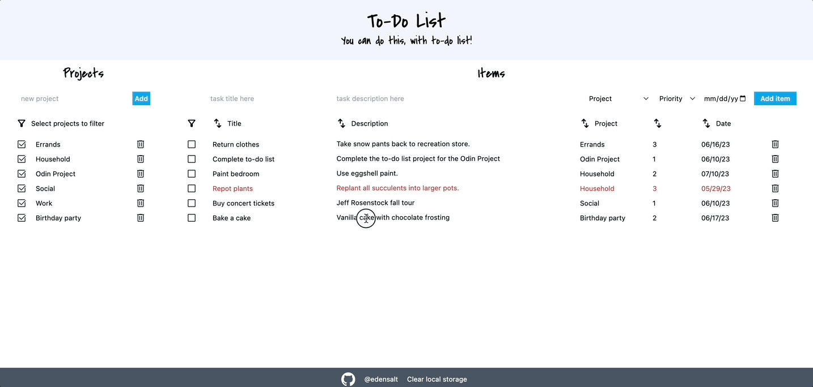

### Welcome! Thanks for stopping by 👋

Below, you'll find a bit of info about me. Feel free to scroll further and check out my public repos, most of which are demonstrations of the skills I've built through <a href="https://www.theodinproject.com/">the Odin Project</a>.

## About me

👩‍💻 I'm Eden, software engineer in progress. I began my programming journey in February 2023, pivoting my career in order to build beautiful, intuitive products.

## My stack

📚 I am proficient in:`
- JavaScript
- Tailwind + Sass
- HTML/CSS
- Vite + Webpack

I'm looking forward to growing this list as I continue my learning!

## How I'm learning

📓 I'm currently completing The Odin Project's <a href="https://www.theodinproject.com/paths/full-stack-javascript">Full Stack Javascript course</a>.

✔️ Completed courses:
- <a href="https://www.theodinproject.com/paths/full-stack-javascript/courses/intermediate-html-and-css">Intermediate HTML & CSS</a>
- <a href="https://www.theodinproject.com/paths/foundations/courses/foundations">Foundations</a>

## My favorite projects

You can check out all of my projects <a href="https://github.com/edensalt?tab=repositories">here</a>. Preview some of my favorites below!

### Weather app
<a href="https://github.com/edensalt/weather-app">Repo</a> || <a href="https://edensalt.github.io/weather-app/">Live preview</a>

### To-do list
<a href="https://github.com/edensalt/todo-list">Repo</a> || <a href="https://edensalt.github.io/todo-list/">Live preview</a>

## My backstory

📈 Before my pivot into programming, I worked for early-stage health-tech start-ups, focusing on marketplace operations and account management. I'm naturally drawn to the energy of start-up environments. My work focused on optimization and scaling, where I built my skillset of process improvement and project management. In this work, I was exposed to Google Apps Scripts, HTML and CSS. These experiences sparked my transition into programming!

🌊 I am a graduate of Tulane University (roll wave!) My degree in public health drives my passion for helping patients in my work, and one of my core values is supporting others in achieving good health.

## Fun facts

📖 I am an avid reader, and GoodReads is my favorite social media platform!

♟️ I've recently gotten into chess (I hear this is a thing programmers do), and I enjoy taking coding breaks on chess.com.

🎸 I play guitar and am currently learning the bass, which isn't too challening, as it's essentially 2/3 of the instrument I already know!
